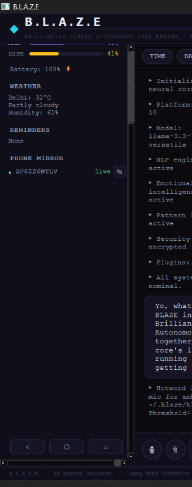
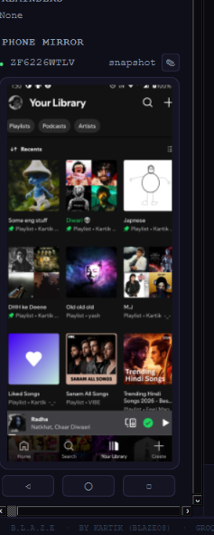
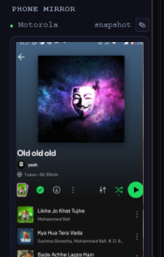
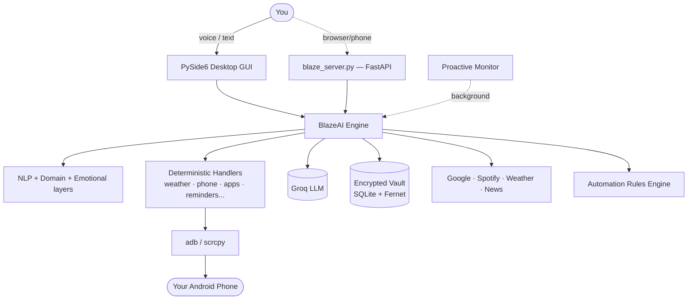
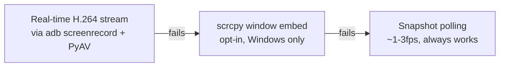

<div align="center">

```
 ██████╗ ██╗       █████╗ ███████╗ ███████╗
 ██╔══██╗██║      ██╔══██╗╚══███╔╝ ██╔════╝
 ██████╔╝██║      ███████║  ███╔╝  █████╗
 ██╔══██╗██║      ██╔══██║ ███╔╝   ██╔══╝
 ██████╔╝███████╗ ██║  ██║███████╗ ███████╗
 ╚═════╝ ╚══════╝ ╚═╝  ╚═╝╚══════╝ ╚══════╝
```

### B R I L L I A N T L Y   L I N K E D   A U T O N O M O U S   Z O N E   E N G I N E

**Your own desktop AI — voice, brains, and a hand on your Android, all running locally on your machine.**

*Built by [Kartik](.) (BLAZE08) · Powered by Groq free inference*

[](#-quickstart)
[](#-tech-stack)
[-0078D6?logo=windows&logoColor=white)](#-platform-notes)
[](https://console.groq.com)
[](#-roadmap)

<sub>⚠️ This README is written for **your** fork of Blaze — badges, license, and repo links are placeholders until you wire up CI/a public repo.</sub>

</div>

---

## 📸 Screenshots

<table>
<tr>
<td width="33%" align="center"><br><sub>Main interface — weather, reminders, and phone mirror sidebar next to the live chat log</sub></td>
<td width="33%" align="center"><br><sub>Phone mirror, enlarged via "make my phone screen bigger" — real device content, live</sub></td>
<td width="33%" align="center"><br><sub>Compact mirror view — auto-detects and names the connected device</sub></td>
</tr>
</table>

<sub>All three are real captures from an active session, not mockups. 🕵️ If you'd rather not show your own phone's device serial/content, swap these for your own captures — they're just PNGs in <code>assets/screenshots/</code>.</sub>

---

## 📖 Table of Contents

<details open>
<summary>Click to collapse/expand</summary>

- [What is Blaze?](#-what-is-blaze)
- [Screenshots](#-screenshots)
- [Feature Matrix](#-feature-matrix)
- [Architecture](#-architecture)
- [Quickstart](#-quickstart)
- [Environment Variables](#-environment-variables)
- [Talking to Blaze](#-talking-to-blaze)
- [Phone Mirror — Deep Dive](#-phone-mirror--deep-dive)
- [Security Notes](#-security-notes)
- [Platform Notes](#-platform-notes)
- [Troubleshooting](#-troubleshooting)
- [Roadmap](#-roadmap)
- [Project Structure](#-project-structure)

</details>

---

## 🔥 What is Blaze?

Blaze is a **local-first desktop AI assistant** with a real personality, a real voice, and real hands — it can see your system stats, control your Android phone, manage your calendar/Gmail/Spotify, remember things about you, learn your habits, and talk back over TTS — all wrapped in a custom dark, terminal-styled PySide6 GUI.

It's not a wrapper around a chat window. Under the hood it's a small operating system for an AI: an NLP layer classifies what you want, a domain-knowledge layer injects specialist context (medicine/law/finance), an emotional-intelligence layer reads your mood, a pattern learner tracks your habits, and a security layer encrypts anything sensitive — before any of it reaches Groq's LLM.

## 🧩 Feature Matrix

<table>
<tr><th>Category</th><th>What it does</th></tr>
<tr><td><strong>🧠 Core AI</strong></td><td>Groq LLM chat, streaming replies, conversation memory, system-command dispatch (<code>[SYSTEM:cmd:arg]</code> tags the model can emit to actually <em>do</em> things)</td></tr>
<tr><td><strong>🗣️ Voice</strong></td><td>Always-on hotword listener, speech-to-text, Edge-TTS + pyttsx3 speech, Talk Mode overlay window</td></tr>
<tr><td><strong>🎭 Personality</strong></td><td>Configurable name/tone/verbosity, emotional-intelligence mood detection with empathetic response prefixes (cooldown-limited so it's never repetitive)</td></tr>
<tr><td><strong>📈 Learning</strong></td><td>Pattern learner tracks command frequency by time-of-day/day-of-week and predicts what you'll want next</td></tr>
<tr><td><strong>📱 Android Control</strong></td><td>Wireless <code>adb</code> pairing, tap/swipe/keyevent input, app launch, battery/notifications, and a live mirror panel (see the <a href="#-phone-mirror--deep-dive">deep dive</a> below)</td></tr>
<tr><td><strong>🔐 Security</strong></td><td>Fernet-encrypted vault, PIN hashing, audit logging, optional HTTPS/rate-limiting/IP-whitelisting for the web server</td></tr>
<tr><td><strong>🔌 Integrations</strong></td><td>Google Calendar, Gmail, Drive, Tasks, Sheets, Contacts, Maps, YouTube, Spotify, live weather + news</td></tr>
<tr><td><strong>⚙️ Automations</strong></td><td>Natural-language rules — <code>"every morning at 8am open Chrome and Spotify"</code>, <code>"when I say work mode, open VS Code and close Discord"</code></td></tr>
<tr><td><strong>🔭 Proactive Monitor</strong></td><td>Background thread for daily briefings, alerts, and habit-based suggestions — Blaze talks to <em>you</em> sometimes, not just the other way around</td></tr>
<tr><td><strong>🧩 Plugins</strong></td><td>Drop a <code>.py</code> file with a <code>register()</code> function into <code>~/.blaze/plugins/</code> and Blaze loads it automatically</td></tr>
<tr><td><strong>🌐 Web/Phone Access</strong></td><td><code>blaze_server.py</code> exposes the same AI over FastAPI/WebSocket at <code>localhost:8000</code>, independent of the desktop GUI</td></tr>
</table>

## 🏗️ Architecture



Handlers run **before** the LLM call whenever the intent is deterministic (checking battery, resizing the phone mirror, telling the time) — faster, and immune to the LLM backend ever being down or a model getting deprecated out from under you (yes, that's happened — see [Troubleshooting](#-troubleshooting)).

## 🚀 Quickstart

<details open>
<summary><strong>1. Clone/copy the project, then set up a virtual environment</strong></summary>

```powershell
cd path\to\Blaze
python -m venv .venv
.venv\Scripts\activate          # macOS/Linux: source .venv/bin/activate
pip install -r requirements.txt
```

If pip complains about an "externally managed environment," append `--break-system-packages`.

</details>

<details>
<summary><strong>2. Create your <code>.env</code></strong></summary>

Copy the variables from the [Environment Variables](#-environment-variables) table below into a new `.env` file in the project root. At minimum you need `GROQ_API_KEY` — everything else unlocks specific integrations.

</details>

<details>
<summary><strong>3. Install the external (non-pip) tools</strong></summary>

| Tool | Why | Get it |
|---|---|---|
| `adb` | Required for **any** phone feature | [Android Platform Tools](https://developer.android.com/tools/releases/platform-tools) |
| `scrcpy` | Only for the legacy embedded-window mirror mode (opt-in) | [github.com/Genymobile/scrcpy](https://github.com/Genymobile/scrcpy) |

Both need to be on your system `PATH`. Verify with `adb --version` and `scrcpy --version`.

</details>

<details>
<summary><strong>4. Run it</strong></summary>

```powershell
py -3.11 -m blaze.main
```

Want the browser/phone-web interface too? Run `python blaze_server.py` separately — it's independent of the desktop app.

</details>

<details>
<summary><strong>5. (Optional) One-time OAuth setup</strong></summary>

```powershell
py -3.11 google_auth.py     # Calendar, Gmail, Drive, Tasks, Sheets
py -3.11 spotify_auth.py    # Playback control
```

Each of these only needs to run **once** — the resulting tokens are saved to your home folder (`~/.blaze_google_token.json`, `~/.blaze_spotify_cache`), not inside the project, so they survive even if you wipe and re-clone the Blaze folder itself.

</details>

## 🔑 Environment Variables

<details>
<summary><strong>Full <code>.env</code> reference (click to expand)</strong></summary>

| Variable | Purpose |
|---|---|
| `GROQ_API_KEY` | **Required.** Free key from [console.groq.com](https://console.groq.com) |
| `GROQ_MODEL` | Override the LLM model (default `openai/gpt-oss-120b`) |
| `GOOGLE_CLIENT_ID` / `GOOGLE_CLIENT_SECRET` | Google Calendar/Gmail/Drive/Tasks/Sheets OAuth |
| `SPOTIFY_CLIENT_ID` / `SPOTIFY_CLIENT_SECRET` / `SPOTIFY_REDIRECT_URI` | Spotify playback control |
| `WEATHER_API_KEY` | Live weather in the sidebar |
| `NEWS_API_KEY` | News briefing handler |
| `BLAZE_CITY` | Default city for weather if location isn't detected |
| `ENCRYPT_CONVERSATIONS` | Encrypt stored chat history at rest |
| `HISTORY_RETENTION_DAYS` | Auto-purge old conversation history |
| `ENABLE_AUDIT_LOG` | Write security-relevant events to the audit trail |
| `REQUIRE_AUTH` / `API_TOKEN` | Gate `blaze_server.py`'s endpoints behind a token |
| `SESSION_TIMEOUT` | Auto-expire web sessions |
| `ENABLE_HTTPS` / `CERT_FILE` / `KEY_FILE` | TLS for the web server |
| `IP_WHITELIST` / `ALLOW_ALL_ORIGINS` | CORS/network restriction for the web server |
| `RATE_LIMIT_REQUESTS` / `RATE_LIMIT_WINDOW` / `MAX_CONNECTIONS` | Basic abuse protection for the web server |
| `SERVER_HOST` / `SERVER_PORT` | Where `blaze_server.py` binds |
| `LOG_LEVEL` / `ENABLE_REQUEST_LOGGING` / `DEBUG_MODE` | Verbosity knobs |
| `BLAZE_KEY_PATH` | Move the vault's encryption key off the default (co-located) path — see [Security Notes](#-security-notes) |
| `BLAZE_ENABLE_SCRCPY_EMBED` | Opt into the legacy scrcpy-window-embed mirror mode (off by default — see below) |

> **Never commit `.env`.** It holds live secrets. Add it to `.gitignore` and keep a blank `.env.example` in the repo instead.

</details>

## 💬 Talking to Blaze

<details>
<summary><strong>Example things you can just say or type</strong></summary>

```
"what's my battery"
"connect my phone"
"take a screenshot"
"display my phone screen"        → enlarges the live mirror panel
"shrink my phone screen"         → back to normal size
"open Spotify on my phone"
"every morning at 8am open Chrome and Spotify"
"when I say work mode, open VS Code and close Discord"
"what's the weather like"
"remind me to call mom at 6pm"
"remember that my favorite color is blue"
"how's my day looking"
```

Phone-related phrases route through a fast, **deterministic** handler (`phone_handler.py`) before ever touching the LLM — so basic device control keeps working even if Groq is having a bad day.

</details>

## 📱 Phone Mirror — Deep Dive

The mirror panel tries **three tiers**, falling back automatically:



| Mode | Speed | Requirements | Notes |
|---|---|---|---|
| **Streaming** (default) | Real-time | `pip install av` | No scrcpy, no window-reparenting, cross-platform |
| **Embed** (opt-in) | Real-time | Windows + `pywin32` + `scrcpy` | Set `BLAZE_ENABLE_SCRCPY_EMBED=1` — more fragile, kept for experimentation |
| **Snapshot** (fallback) | ~1-3 fps | Just `adb` | Always works, always available |

Click the mode label in the panel (e.g. "live") at any time to manually force a fallback to snapshot mode.

If it's stuck on "snapshot" and you expected real-time: check your terminal / `~/.blaze/blaze.log` right when it falls back — it now logs the exact reason (most common cause: `av` didn't actually install).

## 🔒 Security Notes

- The vault's encryption key lives **next to** the encrypted vault by default (`~/.blaze/blaze.key` and `~/.blaze/vault.enc`). Anyone with read access to your home folder can decrypt it. Set `BLAZE_KEY_PATH` to move the key somewhere else (a USB drive, a secrets manager) for real protection.
- `.env` holds live API keys and OAuth secrets — never commit it, never zip it up when sharing the project.
- The web server (`blaze_server.py`) ships with `REQUIRE_AUTH`, `RATE_LIMIT_*`, `IP_WHITELIST`, and `ENABLE_HTTPS` knobs — turn them on before exposing it beyond `localhost`.

## 🖥️ Platform Notes

Blaze's GUI, voice, and AI core are cross-platform. A few pieces are Windows-only by design:

- `pywin32` / `wmi` (system stats, legacy phone-mirror embed) — gracefully no-op elsewhere
- The scrcpy-embed mirror mode specifically — the default streaming mode works on macOS/Linux too

## 🛠️ Troubleshooting

<details>
<summary><strong>Groq returns <code>404 model_not_found</code></strong></summary>

Groq periodically deprecates older models — `llama-3.3-70b-versatile` was decommissioned August 16, 2026. Set `GROQ_MODEL` in `.env` to a currently-supported model (default is now `openai/gpt-oss-120b`), or check [Groq's model list](https://console.groq.com/docs/models) for the current lineup.

</details>

<details>
<summary><strong>Phone mirror is stuck on "snapshot" / feels laggy</strong></summary>

Real-time mode needs `pip install av` inside your active venv. Check your terminal or `~/.blaze/blaze.log` for a line starting with `PyAV not importable` or `Real-time phone mirror stream failed` — it tells you exactly why it fell back.

</details>

<details>
<summary><strong>"The action can't be completed because the folder is open in another program"</strong></summary>

Close VS Code/any terminal pointed at the project folder, check Task Manager for a lingering `python.exe`/`scrcpy.exe`, then retry. Resource Monitor's "Associated Handles" search can find the exact locking process if it persists.

</details>

<details>
<summary><strong>ModuleNotFoundError on launch</strong></summary>

Make sure your venv is activated (`(.venv)` should show in your prompt) and `pip install -r requirements.txt` completed without a red `ERROR:` line.

</details>

## 🗺️ Roadmap

- [x] Real-time phone mirroring without scrcpy-window embedding
- [x] Deterministic phone-control commands (no LLM round-trip)
- [x] Automatic Groq model fallback config
- [ ] Cross-platform packaged installer (currently source-only)
- [ ] Multi-phone simultaneous mirroring
- [ ] Plugin marketplace / discovery
- [ ] Mobile companion app (native, not just web mirror)

## 📁 Project Structure

<details>
<summary><strong>Click to expand full tree</strong></summary>

```
Blaze/
├── blaze/
│   ├── ai/            # engine.py (Groq + dispatch), persona.py, voice.py
│   ├── core/           # database, devices, security, logging/audit
│   ├── gui/            # PySide6 windows/widgets (app_shell, chat_window, phone_mirror...)
│   ├── handlers/       # deterministic command handlers (phone, weather, apps, reminders...)
│   ├── intelligence/   # NLP, domain knowledge, emotional IQ, pattern learner, automations
│   ├── plugins/        # dynamic plugin loader
│   ├── proactive/      # background monitor for briefings/alerts
│   ├── services/       # Google/Spotify/weather/maps/YouTube/android_control integrations
│   ├── config.py
│   └── main.py         # desktop app entry point
├── blaze_server.py     # FastAPI web/phone-browser interface
├── blaze_ui.html        # web client for blaze_server.py
├── google_auth.py       # one-time Google OAuth setup
├── spotify_auth.py      # one-time Spotify OAuth setup
├── requirements.txt
└── .env                 # never commit this
```

</details>

---

<div align="center">

<sub>Made with 🔥 and probably too much caffeine. Not affiliated with any of the services it integrates with.</sub>

</div>
